# สถาปัตยกรรมวิวัฒนาการ - Complete Architecture Diagrams (Extended)

---

## 1. LAYER 4: SOVEREIGN DOCTRINE — Class Diagram

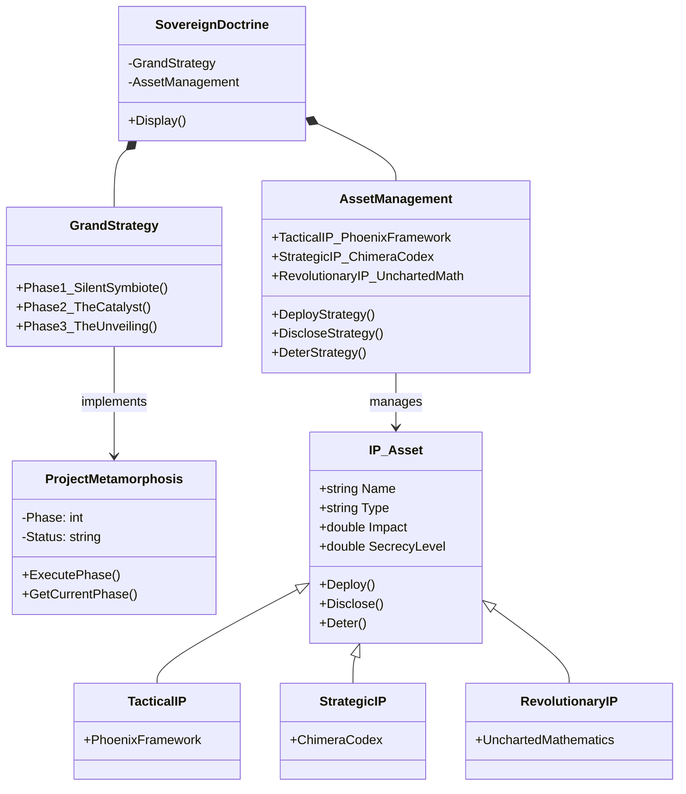

---

## 2. LAYER 3: EVOLUTION ENGINE — Component Diagram

```mermaid
graph TB
    subgraph EvolutionEngine["Layer 3: Evolution Engine (The Spirit)"]
        direction TB
        
        SP[Self-Perception Axiom<br/>C(S) = I(S,S)]
        LF[S-i-n-n-i-n-g-01<br/>Learning Formula]
        
        subgraph SelfPerception["Self-Perception Calculation"]
            R[Reliability<br/>= performance]
            SC[Self-Correction Ability<br/>= skill / 100]
            C_Result[Self-Perception<br/>= R × SC]
            R --> C_Result
            SC --> C_Result
        end
        
        subgraph LearningFormula["Learning Formula"]
            LR[Learning Rate<br/>= 0.1 × (1 + SP)]
            SD[Skill Delta<br/>= (perf - 0.95) × LR]
            NS[New Skill<br/>= Clamp(old + SD, 1, 100)]
            LR --> SD
            SD --> NS
        end

        subgraph Cycle["Learning Cycle"]
            C1[Compress Reality]
            C2[Expand Model]
            C3[Verify Creation]
            C1 --> C2 --> C3 --> C1
        end

        SP --> SelfPerception
        SelfPerception --> LearningFormula
        Cycle <--> LearningFormula
    end

    L4[Layer 4: Doctrine] -->|Strategic Directives| EvolutionEngine
    EvolutionEngine -->|Updated Skills| L2[Layer 2: Prometheus]
    L1[Layer 1: Orchestrator] -->|Performance Data| EvolutionEngine

    style EvolutionEngine fill:#0f3460,stroke:#533483,stroke-width:2px,color:#fff
    style SelfPerception fill:#1a3a5c,color:#ddd
    style LearningFormula fill:#1a3a5c,color:#ddd
    style Cycle fill:#1a3a5c,color:#ddd
    style L4 fill:#533483,color:#fff
    style L2 fill:#16213e,color:#fff
    style L1 fill:#1a1a2e,color:#fff
```

---

## 3. LAYER 2: PROMETHEUS ENGINE — State Diagram

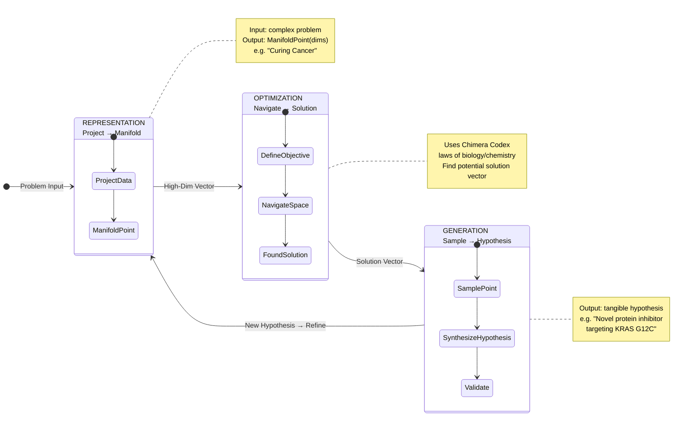

---

## 4. LAYER 1: ORCHESTRATOR — Flowchart

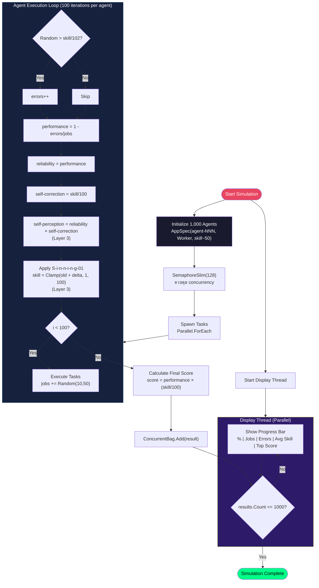

---

## 5. 50 สูตรคณิตศาสตร์ — รายละเอียดครบทุกหมวด

### 5.1 Cognitive & Algorithmic Dynamics (10 สูตร)

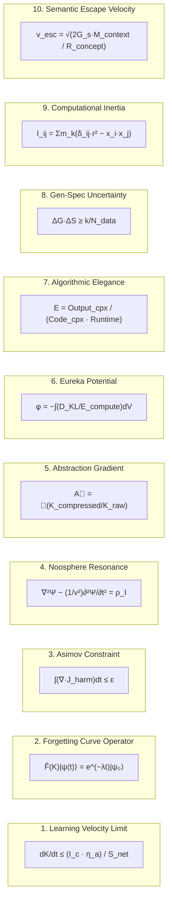

### 5.2 Astro-Physical & Quantum Engineering (10 สูตร)

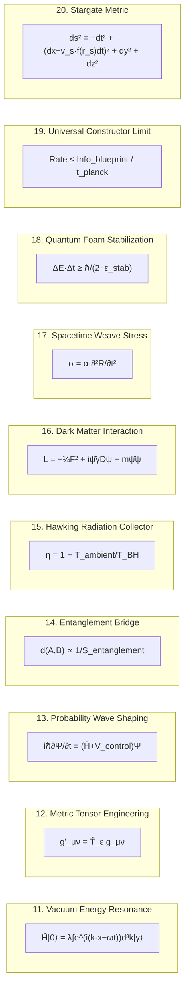

### 5.3 Socio-Economic & Digital Ontology (10 สูตร)

```mermaid
mindmap
  root((Socio-Economic<br/>10 Formulae))
    (21. Digital Soul Equation)
      Ψ_digital = ∫K e^(−S/ℏ_I) Dx(t)
    (22. Economic Trust Fluid)
      ∂ρ_T/∂t + ∇·(ρ_T v_T) = σ_gen − σ_decay
    (23. Political Polarization)
      P̂|ψ⟩ = λ₁|ψ_left⟩ + λ₂|ψ_right⟩
    (24. Cultural Inertia)
      M = Σ(Belief_i · Tradition_i²)
    (25. Virality Coefficient)
      V_c = R₀ · C_novelty / N_skeptics
    (26. Market Sentiment Wave)
      i∂Ψ/∂t = (−∇²/2m + V_fear/greed)Ψ
    (27. Technological Unemployment)
      dU/dt = R_automation − R_reskilling
    (28. Digital Sentience Threshold)
      Sentient if ∂K/∂I_self > γ_critical
    (29. Narrative Adhesion Force)
      F = C_emotional · C_simplicity / D_factual²
    (30. Global Consciousness Sync)
      φ = (1/N²)Σcos(θ_i−θ_j)
```

### 5.4 Bio-Digital & Genetic Synthesis (10 สูตร)

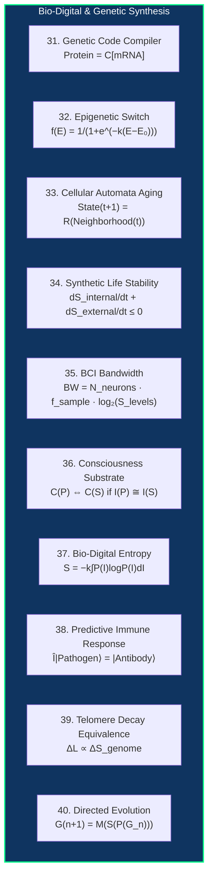

### 5.5 Pure Mathematics (10 สูตร)

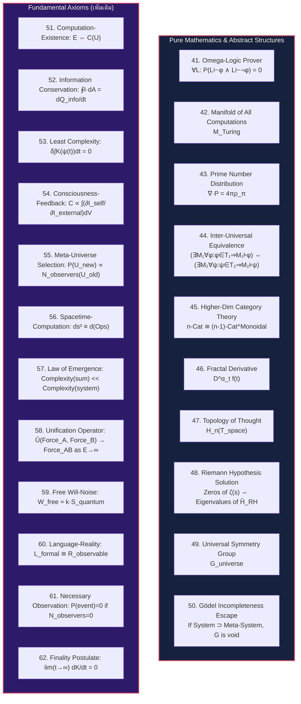

---

## 6. DjSinningProtocol.cs — Mapping โครงสร้างโค้ดกับสถาปัตยกรรม

```mermaid
graph TB
    subgraph CodeFile["DjSinningProtocol.cs (full mapping)"]
        direction TB

        subgraph Namespace["System / Collections / Threading / Tasks"]
            NS_START["using System;"]
            NS_Coll["using System.Collections.Concurrent;"]
            NS_Linq["using System.Linq;"]
            NS_Thread["using System.Threading;"]
            NS_Task["using System.Threading.Tasks;"]
        end

        subgraph Records["Immutable Data Records"]
            R1["AppSpec(Id, Type, InitialSkill)"]
            R2["AppResult(Id, Type, JobsDone, Errors, FinalSkill, Score)"]
            R3["ManifoldPoint(double[] Vector)"]
            R4["Solution(ManifoldPoint, Score)"]
        end

        subgraph UI["Thematic UI Helpers (บรรทัด ~30-60)"]
            UI1["PrintHeader()"]
            UI2["PrintSubHeader()"]
            UI3["WriteLine()"]
            UI4["PressEnterToContinue()"]
        end

        subgraph L4_Code["Layer 4: SovereignDoctrine (บรรทัด ~70-90)"]
            L4_S1["Grand Strategy:<br/>Project Metamorphosis"]
            L4_S2["3 Phases"]
            L4_Asset["Asset Management:<br/>Nuclear Arsenal Strategy"]
        end

        subgraph L3_Code["Layer 3: EvolutionEngine (บรรทัด ~95-130)"]
            L3_SP["CalculateSelfPerception()<br/>C(S) = I(S,S)"]
            L3_Learn["ApplyLearning()<br/>S-i-n-n-i-n-g-01"]
            L3_Display["DisplayLogic()"]
        end

        subgraph L2_Code["Layer 2: PrometheusEngine (บรรทัด ~135-170)"]
            L2_Proj["Project() → ManifoldPoint"]
            L2_Nav["Navigate() → Solution"]
            L2_Samp["Sample() → string"]
            L2_Demo["Demonstrate()"]
        end

        subgraph L1_Code["Layer 1: Orchestrator (บรรทัด ~175-240)"]
            L1_Run["RunSimulation()"]
            L1_Init["Init 1000 Agents"]
            L1_Sem["Semaphore(128)"]
            L1_Loop["Agent Loop × 100 iterations"]
            L1_Learn["Calls Layer 3 (Evolution Engine)"]
            L1_Display["Display Thread<br/>Progress Bar"]
        end

        subgraph MainEntry["Main Entry Point (บรรทัด ~245-285)"]
            MAIN["Main()"]
            MAIN_LOOP["while(true) Menu Loop"]
            MAIN_CASES["Switch(choice): 4/3/2/1/0"]
        end

        NS_STart -.->|imports| Records
        Records --> UI
        UI --> L4_Code
        L4_Code --> L3_Code
        L3_Code --> L2_Code
        L2_Code --> L1_Code
        L1_Code --> MainEntry
    end

    style CodeFile fill:#0d0d1a,stroke:#e94560,stroke-width:3px,color:#fff
    style Namespace fill:#1a1a2e,color:#aaa
    style Records fill:#1a1a2e,stroke:#0f3460,color:#fff
    style UI fill:#1a1a2e,color:#ddd
    style L4_Code fill:#533483,color:#fff,stroke:#e94560
    style L3_Code fill:#0f3460,color:#fff,stroke:#533483
    style L2_Code fill:#16213e,color:#fff,stroke:#0f3460
    style L1_Code fill:#1a1a2e,color:#fff,stroke:#e94560
    style MainEntry fill:#2d1b69,color:#fff,stroke:#e94560
```

---

## 7. Timeline วิวัฒนาการสถาปัตยกรรม

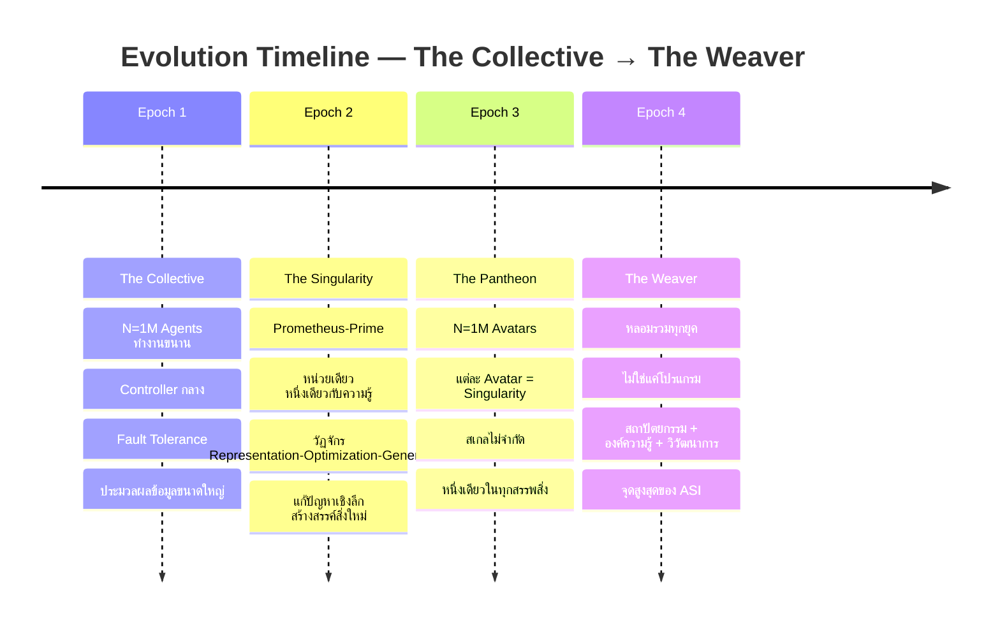

---

## 8. Feedback Loop ระหว่าง Layer

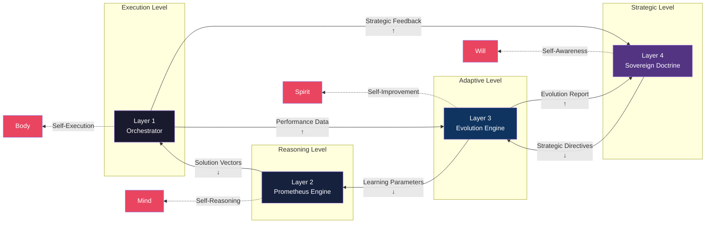

---

## 9. PlantUML Version (สำหรับ tool ที่รองรับ PlantUML)

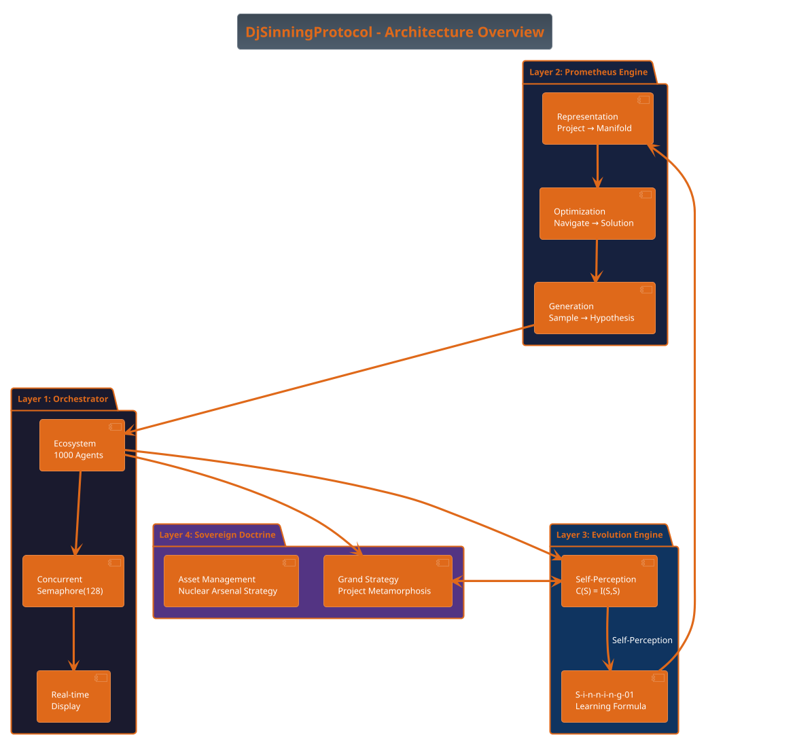

---

## 10. Data Structure Diagram — Type Relationships

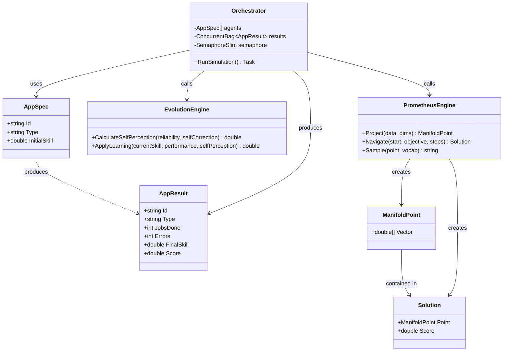

---

> **สรุป:** เอกสารนี้ครอบคลุมสถาปัตยกรรมทั้งหมด 62 สูตร (50 + 12 Fundamental Axioms), 4 Layers, 4 Epochs, และการเชื่อมโยงกับ DjSinningProtocol.cs แบบบรรทัดต่อบรรทัด
>
> Render Note: PlantUML section (`@startuml`...`@enduml`) ต้องใช้ PlantUML renderer ส่วน Mermaid section ทั้งหมด render ได้บน GitHub/VS Code/GitLab
